### Project Details
Topic: Apartment Management System
A system that keeps track of the tenants and their payment status. Can be used by tenants to pay and administrators to manage the apartment.

### Coding Convention
1. Use tab size 4 (four spaces). If hindi four spaces ginagawa ng tab nyo, punta kayo sa *Codio -> Preferences -> User*. Then under [editor] iadd nyo tong line na to: 
**tab_size = 4**
2. Paki indent ng maayos ung code para malinaw basahin.
3. Paki lagyan din ng comment above function definition, isulat nyo ung description nung function na yun, ano ginagawa non ganon.
4. Open brackets on new line.
5. Lagyan ng bracket kahit isa lang ung code sa loob ng control structure.
6. Pascalcase for class names. (example: ClassName)
7. Camelcase for function names. (example: functionName)
8. Camelcase for variable names. 
9. Use class name as file name.

### Admin GUI Map
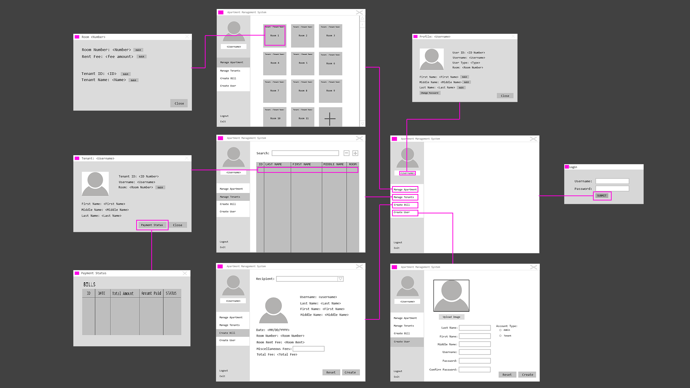

### Tenant GUI Map

### GUI Design
#### Main Tenant Screen
Dimension: 800x600
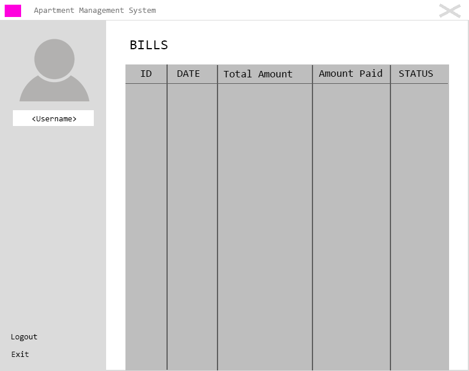
#### Bill Details
Dimension: 500x300
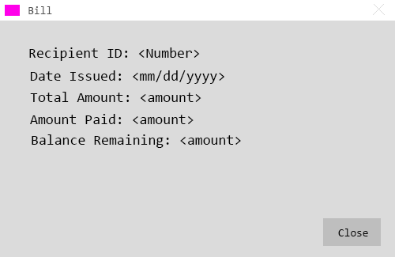
#### Main Admin Screen
Dimension: 800x600
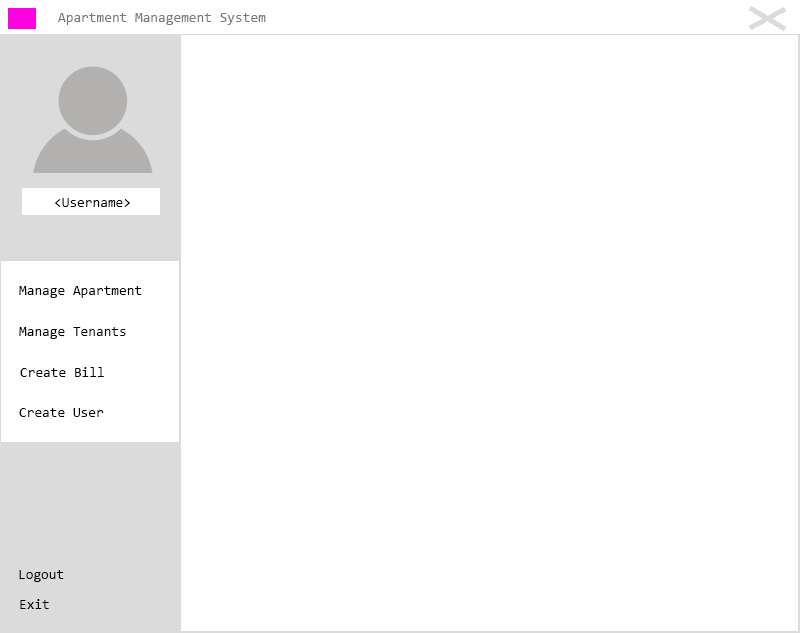
#### Admin Manage Apartment
Dimension: 800x600
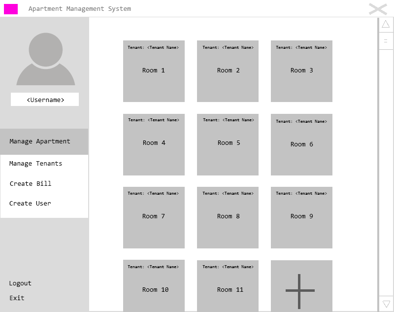
#### Admin Manage Tenants
Dimension: 800x600
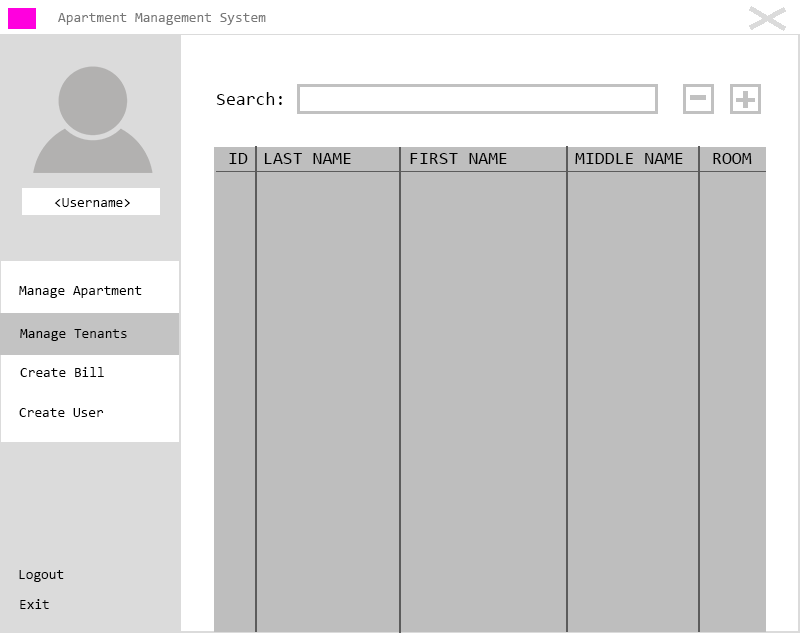
#### Admin Create Bill
Dimension: 800x600
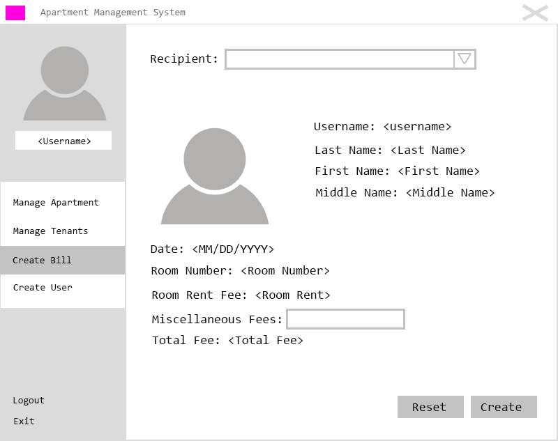
#### Admin Create User
Dimension: 800x600
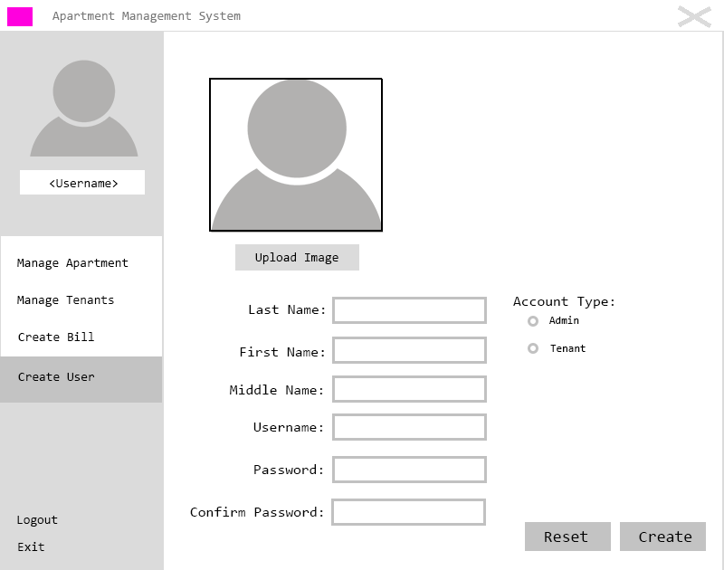
#### Room Details
Dimension: 500x300

#### Tenant Details
Dimension: 500x300
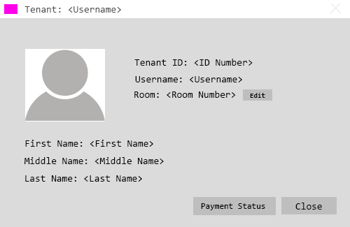
#### Payment Status
Dimension: 500x300
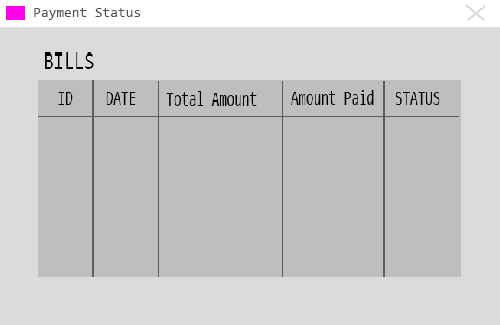
#### Profile Screen
Dimension: 500x300
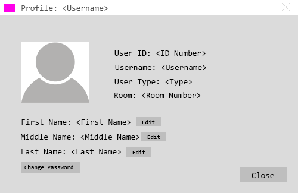
#### Login Screen
Dimension: 400x200
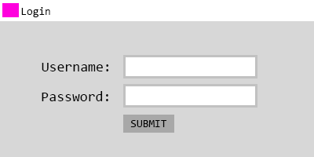
